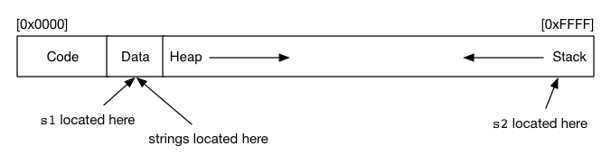

# Tute 1 
## COMP1521 24T2
### Jack Robbers

---

# content

* course intro
* scope
* command line arguments
* compilation steps

---

# whoami

Jack Robbers

6th Year Electrical Engineering / Computer Science

---

# the worst part of uni

icebreaker(s)

---

# links

* [course website](https://cgi.cse.unsw.edu.au/~cs1521/24T2)
* [j.robbers@unsw.edu.au](mailto:j.robbers@unsw.edu.au)
* [tute code and slides: ](https://github.com/JackRobbers/comp1521/tree/main/24T2) github.com/JackRobbers/comp1521

---

# a note

what you find easy might not be easy for others

be nice

---
what's different between s1 and s2?

```c
#include <stdio.h>

char *s1 = "abc";

int main(void) {
  char *s2 = "def";
  // ...
}
```

---



---

what's wrong here?

```c
#include <stdio.h>

int *get_num_ptr(void);

int main(void) {
    int *num = get_num_ptr();
    printf("%d\n", *num);
}

int *get_num_ptr(void) {
    int x = 42;
    return &x;
}
```

---

what's wrong here?

```c
#include <stdio.h>

int main(void) {
    char str[10];
    str[0] = 'H';
    str[1] = 'i';
    printf("My message is: %s\n", str);
    return 0;
}
```

---

how could we rewrite this as a for loop?

```c
#include <stdio.h>

int main(void) {
  int i = 0;
  while (i < 10) {
    printf("%d\n", i);
    i++;
  }
  return 0;
}
```


---

# command line arguments

In groups, write a program called "print_arguments" that prints the command line arguments to a program. What does your program output when you run `print_arguments COMP1521 24T1`

If you get time, write another program to find the sum of the arguments e.g `sum_arguments 1 2 3 4 5` should print out "15"

---

# steps of compilation

* pre processor - replaces #includes and #defines. - `-E`
* compiler - produces assembly for the targetted machine - `-S`
* assemble - produce machine (binary) code - `-c`