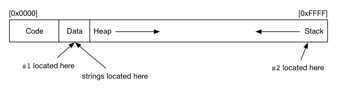

# Tute 1

## COMP1521 25T3

### Jack Robbers

---

# content

- course intro
- scope
- command line arguments
- compilation steps

---

# whoami

Jack Robbers

7th Year Electrical Engineering / Computer Science

---

# links

- [course website](https://cgi.cse.unsw.edu.au/~cs1521/25T3)
- [j.robbers@unsw.edu.au](mailto:j.robbers@unsw.edu.au)
- [tute code and slides: ](https://github.com/JackRobbers/comp1521/tree/main/25T3) github.com/JackRobbers/comp1521/tree/main/25T3

---

# a note

what you find easy might not be easy for others

be nice

---

what's different between s1 and s2?

```c
#include <stdio.h>

char *s1 = "abc";

int main(void) {
  char *s2 = "def";
  // ...
}
```

---



---

# command line arguments

In groups, write a program called "print_arguments" that prints out its command line arguments. What does your program output when you run `print_arguments COMP1521 24T1`

If you get time, write another program to find the sum of integer arguments e.g `sum_arguments 1 2 3 4 5` should print out "15"

---

# steps of compilation

- pre processor - replaces #includes and #defines. - `-E`
- compiler - produces assembly for the targetted machine - `-S`
- assemble - produce machine (binary) code - `-c`
